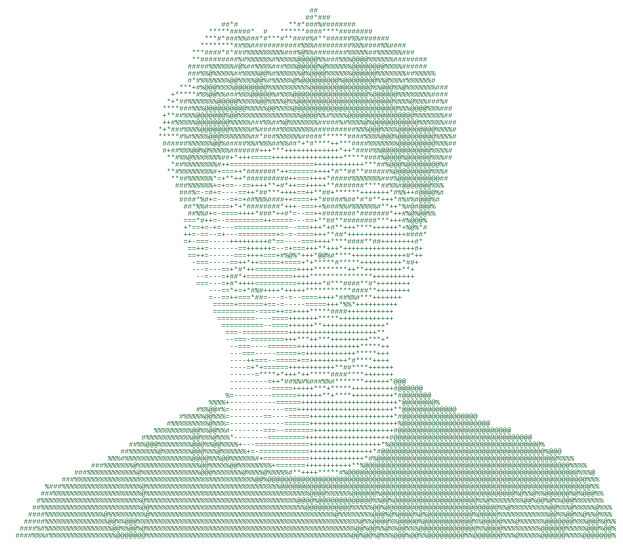

# Hi, I'm Henrique 👋

### Computer Engineering Student @ FEUP (University of Porto)

---

<table>
<tr>
<td valign="top">
<picture>
  <source media="(prefers-color-scheme: dark)" srcset="assets/ascii-dark.svg">
  <source media="(prefers-color-scheme: light)" srcset="assets/ascii-light.svg">
  
</picture>
</td>
<td valign="top">
<pre>
henrique@feup ----------------------------------
University: .............. FEUP, Porto
Course: .................. Informatics &amp; Computer Eng.
Year: .................... 3rd Year
-
Uptime: .................. 1y 2m 22d (on GitHub)
Currently Learning: ...... Machine Learning
Focus Areas: ............. Cybersecurity, Web Dev
-
Languages.Programming: ... Java, Python, JavaScript, C, C++
Languages.Web: ........... HTML, CSS, TypeScript
Languages.Real: .......... Portuguese, English
-
Interests: ............... Sports, Fitness, Tech, Security
Contact ----------------------------------------
Email: ................... sobradohenrique@gmail.com
LinkedIn: ................ henrique-pereira-95003a305
GitHub Stats -----------------------------------
Repos: ................... 4  |  Stars: 0
Followers: ............... 2  |  Following: 3
</pre>
</td>
</tr>
</table>

---

## 🚀 About Me

I'm a 3rd-year Computer/Informatics Engineering student at **FEUP** (Faculdade de Engenharia da Universidade do Porto), with a wide range of interests across the tech world - from building full-stack web apps to understanding how systems can be broken (and secured).

## 🔍 Currently Exploring

- 🤖 **Machine Learning** - working through the fundamentals and building small projects
- 🔐 **Cybersecurity** - learning how systems break so I can help build ones that don't
- 💻 Frontend & backend development for web apps and other software

## 🏃 Outside of Code

I like to stay active - sports and a healthy lifestyle keep me balanced alongside my studies.

---

## 📫 Where to Find Me

---

## 🛠️ Tech Stack

**Frontend & Design**

**Backend, Databases & Data**

**Currently Learning**

**Infrastructure, DevOps & Tools**

